# ACM Mode vs Non-ACM Mode Sequence Diagram

This document illustrates the code flow differences between ACM mode enabled and disabled scenarios when processing multi-cluster requests.

## ACM Mode Enabled Flow

## ACM Mode Disabled Flow (Current Implementation)

## Proposed Enhanced Flow (Non-ACM Mode with Validation)

```mermaid
sequenceDiagram
    participant Client
    participant MCPServer
    participant ToolHandler
    participant LocalClusterKubeAPI as Local Cluster Kube API

    Client->>MCPServer: Request with cluster="jb-mc-1"
    MCPServer->>ToolHandler: Execute tool (params.IsACMMode=false)
    ToolHandler->>ToolHandler: GetClusterParameter() → "jb-mc-1", true
    ToolHandler->>ToolHandler: Validate: cluster param provided but ACM mode disabled
    ToolHandler-->>MCPServer: Error: "cluster parameter 'jb-mc-1' provided<br/>but ACM mode is not enabled.<br/>Use --acm-mode flag to enable multi-cluster operations"
    MCPServer-->>Client: Clear error message
    Note over Client: ✅ User understands the issue<br/>and knows how to fix it
```

## Key Differences

| Scenario | Cluster Parameter | ACM Mode | Behavior | Risk Level |
|----------|------------------|----------|----------|------------|
| **ACM Enabled** | ✅ Provided | ✅ Enabled | Routes to target cluster | ✅ Safe |
| **ACM Disabled (Current)** | ✅ Provided | ❌ Disabled | **Silently uses local cluster** | 🚨 **Dangerous** |
| **ACM Disabled (Proposed)** | ✅ Provided | ❌ Disabled | **Returns clear error** | ✅ Safe |
| **No Cluster Param** | ❌ Not provided | Either | Uses local cluster | ✅ Safe |

## Code Locations

- **Flag Definition**: `pkg/kubernetes-mcp-server/cmd/root.go:137`
- **ACM Proxy Logic**: `pkg/api/toolsets.go:105-110`
- **ACM Proxy Client**: `pkg/acm/client.go`
- **Tool Handlers**: `pkg/toolsets/core/*.go`

## Security Implications

The current silent fallback behavior poses security risks:

1. **Unintended Operations**: Users might accidentally modify/delete resources on the wrong cluster
2. **Data Leakage**: Sensitive information from the local cluster could be exposed when users expect data from a different cluster
3. **Compliance Issues**: Operations intended for non-production clusters might be executed on production environments

The proposed validation approach eliminates these risks by failing fast with clear error messages.

## ✅ WORKING IMPLEMENTATION (Updated 2025-01-14)

### Successful ACM Cluster-Proxy Integration

After extensive debugging and testing, the correct ACM cluster-proxy implementation has been discovered and implemented:

**🔧 Key Breakthrough: Service-Based Routing Pattern**

### Technical Implementation Details

**✅ Working Components:**
- **External Route**: `cluster-proxy-user.apps.{acm-domain}` (dynamically discovered)
- **URL Pattern**: `https://{discovered-route}/{cluster}{kubernetesApiPath}`
- **Authentication**: Standard Kubernetes bearer tokens
- **Proxy Infrastructure**: cluster-proxy-proxy-agent pods running on managed clusters
- **Route Discovery**: Automatic discovery via OpenShift Route API

**✅ Verified Operations:**
- Pod listing across namespaces ✅
- Multi-cluster resource access ✅
- Real-time API responses ✅
- Transparent authentication ✅

**🎯 Result**: Enterprise-grade multi-cluster management through single MCP interface