# ACM Mode vs Non-ACM Mode Sequence Diagram

This document illustrates the code flow differences between ACM mode enabled and disabled scenarios when processing multi-cluster requests.

## ACM Mode Enabled Flow

```mermaid
sequenceDiagram
    participant Client
    participant MCPServer
    participant ToolHandler
    participant ACMClusterProxy
    participant ManagedClusterKubeAPI as Managed Cluster Kube API
    participant LocalClusterKubeAPI as Local Cluster Kube API

    Client->>MCPServer: Request with cluster="jb-mc-1"
    MCPServer->>ToolHandler: Execute tool (params.IsACMMode=true)
    ToolHandler->>ToolHandler: GetClusterParameter() → "jb-mc-1", true
    ToolHandler->>ToolHandler: ShouldUseACMProxy() → "jb-mc-1", true
    ToolHandler->>ACMClusterProxy: ProxyRequest(cluster="jb-mc-1", apiPath)
    ACMClusterProxy->>ACMClusterProxy: Build proxy URL:<br/>/apis/proxy.open-cluster-management.io/v1beta1/<br/>namespaces/jb-mc-1/clusterstatuses/jb-mc-1{apiPath}
    ACMClusterProxy->>ManagedClusterKubeAPI: HTTP Request via ACM Cluster Proxy
    ManagedClusterKubeAPI-->>ACMClusterProxy: Response (pods, resources, etc.)
    ACMClusterProxy-->>ToolHandler: Proxy Response
    ToolHandler-->>MCPServer: Tool Result from jb-mc-1
    MCPServer-->>Client: Response with data from jb-mc-1
```

## ACM Mode Disabled Flow (Current Implementation)

```mermaid
sequenceDiagram
    participant Client
    participant MCPServer
    participant ToolHandler
    participant LocalClusterKubeAPI as Local Cluster Kube API

    Client->>MCPServer: Request with cluster="jb-mc-1"
    MCPServer->>ToolHandler: Execute tool (params.IsACMMode=false)
    ToolHandler->>ToolHandler: GetClusterParameter() → "jb-mc-1", true
    ToolHandler->>ToolHandler: ShouldUseACMProxy() → "", false
    Note over ToolHandler: ⚠️ PROBLEM: cluster parameter silently ignored!
    ToolHandler->>LocalClusterKubeAPI: Execute request on local cluster
    LocalClusterKubeAPI-->>ToolHandler: Response from LOCAL cluster
    ToolHandler-->>MCPServer: Tool Result from LOCAL cluster
    MCPServer-->>Client: Response with data from LOCAL cluster
    Note over Client: ⚠️ User thinks data is from jb-mc-1<br/>but it's actually from local cluster!
```

## Proposed Enhanced Flow (Non-ACM Mode with Validation)

```mermaid
sequenceDiagram
    participant Client
    participant MCPServer
    participant ToolHandler
    participant LocalClusterKubeAPI as Local Cluster Kube API

    Client->>MCPServer: Request with cluster="jb-mc-1"
    MCPServer->>ToolHandler: Execute tool (params.IsACMMode=false)
    ToolHandler->>ToolHandler: GetClusterParameter() → "jb-mc-1", true
    ToolHandler->>ToolHandler: Validate: cluster param provided but ACM mode disabled
    ToolHandler-->>MCPServer: Error: "cluster parameter 'jb-mc-1' provided<br/>but ACM mode is not enabled.<br/>Use --acm-mode flag to enable multi-cluster operations"
    MCPServer-->>Client: Clear error message
    Note over Client: ✅ User understands the issue<br/>and knows how to fix it
```

## Key Differences

| Scenario | Cluster Parameter | ACM Mode | Behavior | Risk Level |
|----------|------------------|----------|----------|------------|
| **ACM Enabled** | ✅ Provided | ✅ Enabled | Routes to target cluster | ✅ Safe |
| **ACM Disabled (Current)** | ✅ Provided | ❌ Disabled | **Silently uses local cluster** | 🚨 **Dangerous** |
| **ACM Disabled (Proposed)** | ✅ Provided | ❌ Disabled | **Returns clear error** | ✅ Safe |
| **No Cluster Param** | ❌ Not provided | Either | Uses local cluster | ✅ Safe |

## Code Locations

- **Flag Definition**: `pkg/kubernetes-mcp-server/cmd/root.go:137`
- **ACM Proxy Logic**: `pkg/api/toolsets.go:105-110`
- **ACM Proxy Client**: `pkg/acm/client.go`
- **Tool Handlers**: `pkg/toolsets/core/*.go`

## Security Implications

The current silent fallback behavior poses security risks:

1. **Unintended Operations**: Users might accidentally modify/delete resources on the wrong cluster
2. **Data Leakage**: Sensitive information from the local cluster could be exposed when users expect data from a different cluster
3. **Compliance Issues**: Operations intended for non-production clusters might be executed on production environments

The proposed validation approach eliminates these risks by failing fast with clear error messages.